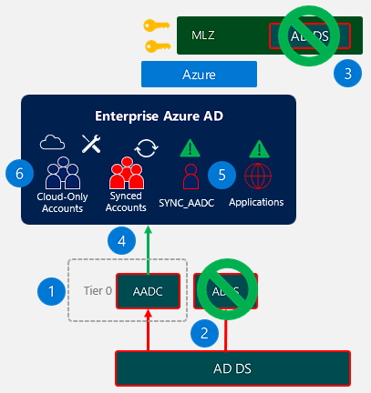

# Permissions in Azure and Azure AD
Document to describes permissions management and delegation models for Mission Landing Zone deployments.

## Table of Contents
 - [Permissions Types](#permissions-in-azure-and-azure-ad)
 - [Security Boundary](#security-boundary)
 - [MLZ Identity Management](#mlz-identity-management)
   - [Centralized Management](#centralized-management)
   - [Delegated Management](#delegated-management)
 - [MLZ Security Operations Management](#mlz-security-operations-management)
   - [Centralized](#centralized)
   - [Delegated](#delegated)
   - [Outsourced](#outsourced)
 - [Advanced Topics](#advanced-topics)
   - [MitigateHybrid Identity Attack Paths](#mitigate-hybrid-identity-attack-paths)
   - [Understand Management-Data Plane Crossover](#understand-management-data-plane-crossover)
 - [See Also](#see-also)

## Permissions Types
There are slightly different permissions models for various Microsoft cloud services. The table below describes the permissions for setting up and managing Mission Landing Zone environments. Permissions for individual M365 services are beyond the scope of this document.

| **Type** | **Assigned To** | **Exclusions** | **Scope** |
|----------|-----------------|----------------|-----------|
| Azure AD Permission | All security principals (users, groups, applications1,managed identities2) | Only cloud-only security groups designated as Role-Assignable (Privileged Access Groups) | <ul><li>Directory</li><li>Administrative Unit</li><li>Resource3</li></ul> |
| Azure Resources | <ul><li>All security principals (users, groups, applications)</li><li>Security principals in other tenants (Azure Lighthouse)</li></ul>| N/A | <ul><li>Management Group</li><li>Subscription</li><li>Resource Group</li><li>Resource</li></ul>|
| Microsoft Graph API | Applications | N/A | API Scope4 | 

1 The identity of an application registration is a Service Principal. Application / App Registration / Service Principal may be used interchangeably to describe an application identity.

2 Managed identities are non-person identities automatically assigned to many Azure resources. Resources use this identity to access applications, APIs, and other resources protected by Azure AD. 

> **Warning**: Do not assign managed identities or service principals to Azure AD roles. Doing this can create a scenario where privilege escalation is possible within the environment.

3 Here "resource" is an individual security principal that can have Owner be another security principal. For example, a group or application may have an Owner that can manage all aspects of the application, without any additional privileges in Azure AD.

4 MS Graph API scope is a resource-level permission, e.g. User.Read.All or User.ReadWrite.All.

> 📘 **Reference**:
>  - [Azure AD built-in roles](https://learn.microsoft.com/en-us/azure/active-directory/roles/permissions-reference)
>  - [Azure AD least-privilege roles by task](https://learn.microsoft.com/en-us/azure/active-directory/roles/delegate-by-task)
>  - [Azure RBAC Docs](https://learn.microsoft.com/en-us/azure/role-based-access-control/)
>  - [Overview of Microsoft Graph](https://learn.microsoft.com/en-us/graph/overview?view=graph-rest-1.0)

## Security Boundary
The security boundary for an Azure environment is the Azure AD tenant. Global Administrator, the highest level Azure AD permission, can assign themselves to User Access Administrator / Owner for any subscription pinned to that Azure AD.

For Azure resources, the subscription itself plays a special role for two reasons:
1. Some Azure RBAC permissions, like VM Contributor, allow actions *only* when the role is assigned at the subscription level or higher.
2. While Magement Groups sit above the subscriptions in the Azure RBAC scope hierarchy, they *usually* are not used for scope within Azure RBAC roles. Management Groups are primarily used for assigning Azure Policy.

> **Note**: Azure Lighthouse is a technology that enables RBAC assignments for security principals in another tenant. In an MSSP model, users from the managing tenant may have access to subscriptions without having a security principal in the tenant itself.

## MLZ Identity Management
Since the identity platform is the [security boundary](#security-boundary) for Azure, securing and managing it are important undertakings. This section covers two models for managing Azure AD for MLZ deployments:
- [Centralized Management](#centralized-management)
- [Delegated Management](#delegated-management)

### Centralized Management
In the centralized management model, one team within the organization is tasked with all tasks within the identity platform.

Common tasks include:
- Creating and managing users / groups
- Assigning licenses
- Assigning permissions
- Creating and managing applications
- Configuring Conditional Access
- Configuring and managing hybrid identity components like Azure AD Connect
- Enabling new features

Use Centralized Management for:
 - [x] Small organizations with few administrators
 - [x] Initial model for tenant setup

> **Warning**: Centralized management does **not** mean all admins should be Global Administrators. Refer to [Azure AD least-privilege roles by task](https://learn.microsoft.com/en-us/azure/active-directory/roles/delegate-by-task) and assign role eligibility using Privileged Identity Management.

### Delegated Management
Delegated management is more common for enterprise environments. In this model, common tasks are delegated to mission owners so various groups in the organization can manage aspects of the identity platform. This section outlines common tasks and delegation configuration.

Use Delegated Management for:
 - [x] Large organizations with geographically separated teams
 - [x] Distrubting administrative activities without over-permissioning
 - [X] Enabling subscription owners to manage users, groups, and RBAC

> **Note**: Not every activity within Azure AD can or should be delegated.

A sample delegated model is shown in the image below:

#### User and Group Management

| Task | Configuration |
|------|---------------|
| User creation | At the time of writing, this task cannot be delegated without assigning User Administrator role at the directory level|
| User management | Create an Administrative Unit and scope **User Administrator** role to the AU|
| Group creation | Create an AU and scope **Group Administrator** role to the AU |
| Group management | Assign owner directly, or move the group in an AU and scope **Group Administrator** role to the AU |

> 📘 **Reference**: [Administrative Units (Groups)](https://learn.microsoft.com/en-us/azure/active-directory/roles/administrative-units#groups)

#### Application Management

| Task | Configuration |
|------|---------------|
| Enterprise App Creation | At the time of writing, this task cannot be delegated without assigning Cloud Application Administrator role at the directory level|
| App Registration | Assign **Application Developer** role which allows Create As Owner permissions for App Registrations and Service Principals|
| Application Management | Assign owner directly to the Enterprise Application and/or App Registration|

> **Note**: If the User Setting "Restrict Portal Access to the Azure AD Administration Portal" is set to **Yes**, application management blade will not be available unless the user is assigned an Azure AD directory role. This restriction holds even if the user is an owner of the application.

> 📘 **Reference**: [App registration Custom Role Permissions](https://learn.microsoft.com/en-us/azure/active-directory/roles/custom-available-permissions)

#### Subscription Management

| Task | Configuration |
|------|---------------|
| Manage RBAC assignments | Assign RBAC role via group, assign managers as owner to the group |
| Create new RBAC groups | Assign **User Access Administrator** via RBAC role. Delegate ability to create security groups (see [User and Group Management](#user-and-group-management))|
| Remove an RBAC assingment | Remove user from a group providing RBAC access. This can be done as **Group Administrator** for the AU, or owner of the group|

## MLZ Security Operations
Security operations outlined in this section include managing Sentinel and Defender for Cloud.

### Centralized
In the centralized model, a single security team is reponsible for managing security operations and security posture managemnet of the MLZ environment. When Sentinel and Defender for Cloud are included using the MLZ deployment scripts, the security model is assumed to be centralized.

#### Microsoft Sentinel
The [MLZ AAD Baseline](/MLZ-Identity-AzureADSetup/doc/AAD-Config-Baseline.md) creates a security group **MLZ Security Admins** with full access to Microsoft Sentinel (Microsoft Sentinel Contributor, Logic App Contributor)

Initial setup of the Microsoft Sentinel data connectors will be configured by a Global Administrator.  These connectors may include but are not limited to:
 - [x] Azure Active Directory
 - [x] Azure Active Directory Identity Protection
 - [x] Azure Activity (all subscriptions)
 - [x] Azure-specific connectors (all applicable)
 - [x] M365 Defender connectors (all applicable)
 - [x] Security Events via AMA (all subscriptions)
 - [x] Windows DNS Events via AMA (Preview)
 - [x] Windows Forwarded Events (Preview)
 - [x] Syslog
 - [x] Threat Intelligence Platforms (Preview)

> 📘 **Reference**: [Roles and permissions in Microsoft Sentinel](https://learn.microsoft.com/en-us/azure/sentinel/roles)

#### Defender for Cloud
The [MLZ AAD Baseline](/MLZ-Identity-AzureADSetup/doc/AAD-Config-Baseline.md) creates a security group **MLZ Security Admins** with full access to Defender for Cloud. In addition, users with access to an MLZ subscription can see see/manage alerts and Defender for Cloud.

> 📘 **Reference**: [Permissions in Defender for Cloud](https://learn.microsoft.com/en-us/azure/defender-for-cloud/permissions)

### Delegated
In the delegated model, the **MLZ Security Admins** are responsible for setting up Sentinel and Defender for cloud for the core MLZ subscriptions. New spoke subscriptions for mission owners manage security events and manage cloud security posture for their own Azure workloads in silos.

#### Microsoft Sentinel
In the delegated model, the Microsoft Sentinel workspace deployed with MLZ is used for MLZ core subscriptions + Azure AD connectors. Each new mission spoke subscription gets its own Sentinel instance for security event management. Because the core **MLZ Security Admins** group will have read access to spoke subscriptions, configuring Defender for Cloud connectors for those subscriptions is possible.

Consider the below setup for an MLZ deployment with 2 independent "mission spoke" subscriptions:

  - **MLZ Core** Sentinel workspace
    - [x] Azure AD connectors
    - [x] MLZ Core resources
      - [x] Azure resource connectors for MLZ core subscriptions
      - [x] Security events via AMA for MLZ core subscriptions
      - [x] Defender for Cloud for MLZ core subscriptions
    - [ ] **Mission A** MLZ Resources
      - [ ] Azure resource connectors for **Mission A** spoke subscription
      - [ ] Security events via AMA for **Mission A** spoke subscription
      - [x] Defender for Cloud for **Mission A** spoke subscription
    - [ ] **Mission B** MLZ Resources
      - [ ] Azure resource connectors for **Mission B** spoke subscription
      - [ ] Security events via AMA for **Mission B** spoke subscription
      - [x] Defender for Cloud for **Mission B** spoke subscription
  - **Mission Owner A** spoke subscription Sentinel workspace
    - [ ] Azure AD connectors
    - [ ] MLZ Core resources
    - [x] **Mission A** MLZ Resources
      - [x] Azure resource connectors for **Mission A** spoke subscription
      - [x] Security events via AMA for **Mission A** spoke subscription
      - [x] Defender for Cloud for **Mission A** spoke subscription
    - [ ] **Mission B** MLZ Resources
  - **Mission Owner B** spoke subscription Sentinel workspace
    - [ ] Azure AD connectors
    - [ ] MLZ Core resources
    - [ ] **Mission A** MLZ Resources
    - [x] **Mission B** MLZ Resources
      - [x] Azure resource connectors for **Mission B** spoke subscription
      - [x] Security events via AMA for **Mission B** spoke subscription
      - [x] Defender for Cloud for **Mission B** spoke subscription

> 💡 **Recommendation**: Assign **MLZ Security Admins** read access to all Sentinel workspaces within the MLZ, even in the delegated model. This group can perform cross-workspace queries and hunt across the MLZ environment, including the siloed spoke subscriptions.

#### Defender for Cloud
Mission spoke subscription owners should configure RBAC roles for Defender for Cloud. Users with access to spoke subscriptions can see and manage Defender for Cloud for their own resources.

> 📘 **Reference**: [Permissions in Defender for Cloud](https://learn.microsoft.com/en-us/azure/defender-for-cloud/permissions)

### Outsourced
In this model, Azure Lighthouse is used to grant access to an external organization. The following access should be granted:
- Sentinel Contributor (all subscriptions)
- Log Analytics Contributor (all subscriptions)
- Security Administrator (all subscriptions)

> 📘 **Reference**: [What is Azure Lighthouse](https://learn.microsoft.com/en-us/azure/lighthouse/overview)

## Advanced Topics
This section is a placeholder for advanced security topics for permissions in Azure AD and Azure. 

### Understand Management-Data Plane Crossover
As the cloud identity story evolves, every resource becomes an identity that can securely access any other resource based on the permissions granted to it's identity. Because of this, ownership of any resource means ability to access as that resource.

#### Example Scenario
A legacy web application is deployed to several servers in Azure. Code running on each server needs some access to Microsoft Graph to perform automation against Azure AD. To simplify RBAC, an app registration is created, and each VM managed identity is given access to a client secret stored in Key Vault. When the application code runs on one of the VMs, it uses the VM managed identity to retrieve the secret using the Key Vault API. This method avoids storing application credentials in code, but allows cross-plane lateral movement, possibly escalation.

#### Plane-Crossing risk
A user with local admin on the VM can elevate their effective Azure AD privileges by impersonating the application.

**How?**
If user is assigned local administrator on the VM, they can retrieve an access token as the VM managed identity and use the VM's access token to retrieve the client secret from key vault. With the client secret, the user can initialize an MS Graph client with the application credential.

**Mitigation**
Defender for Cloud helps identify and prioritize remediation for vulnerable resources by exposing the attack paths an attacker could abuse if they compromise the vulnerable resource.

> 📘 **Reference**: [Identify and remediate attack paths](https://learn.microsoft.com/en-us/azure/defender-for-cloud/how-to-manage-attack-path)

### Mitigate Hybrid Identity Attack Paths
Establishing hybrid identity is a fundamental part of establishing an enterprise identity platform, and one of the first steps an organization can take in adopting zero trust principals. 

#### Attack Paths
Review the diagram below for hybrid identity attack paths:

 1. Control of on-premises AD DS &rarr; Control of Azure AD Connect Synchronization server
 2. Control of on-premises AD DS &rarr; Control of AD DS forest in Azure1
 3. Control of on-premises AD DS &rarr; Control of AD FS2
 4. Control of AAD Connect &rarr; Control of **Sync_AADC_** user
  - Control users and groups synchronized by Azure AD Connect
  - UPN-Match existing cloud-only users and control them
  - Read passwords if Pass-Through Authentication is enabled3
   - Effective permissions of the **Directory Synchronization Accounts** role
 5. Control of ADFS &rarr; Sign in as any federated user in Azure AD
  - Without HSM - via exfil ADFS signing certificate private key
  - With HSM - via claims manipulation in ADFS issuance rules
 6. Access to **Directory Synchronization Acounts** can add credentials to existing applications4

1 Applicable if AD DS in Azure is a new site for existing AD DS forest.

2 Applicable only if ADFS is used to federate an Azure AD user domain. ADFS is strongly discouraged for use in new AAD hybrid identity deployments.

3 Applicable only if Pass-Through-Authentication (PTA) is use. PTA is discouraged unless regulatory compliance dictates use of on-premises authentication.

4 Azure AD automatically rejects credentials supplied for out-of-box service principals (e.g. MS_PIM)

> 📘 **Reference**: [Azure AD Connect account](https://learn.microsoft.com/en-us/azure/active-directory/hybrid/reference-connect-accounts-permissions#azure-ad-connector-account)

#### Recommended Mitigations
Review the diagram below for mitigating hybrid identity attack paths:

 1. Treat Azure AD Connect as a Tier 0 service (limit logon as you would a Domain Controller).
 2. Use Azure AD cloud-native authentication mechanisms like AAD Certificate-Based Authentication, FIDO2 security keys, Windows Hello, or MS Authenticator App passwordless.
 3. **Assume Breach** - Migrate legacy applications to use Azure Active Directory.
 4. Avoid assigning Azure AD or Azure RBAC permissions to synchronized user accounts.
 5. Use Azure security tools to detect unusual activity for Azure AD synchronization account.
   - Set up Conditional Access for workload identities to restrict use of Azure AD Connect Sync account to a known IP address range.
   - Use [M365 Defender](https://learn.microsoft.com/en-us/microsoft-365/security/defender/m365d-enable?view=o365-worldwide) to detect unusual credentials added to an OAuth App
   - Use [Defender for Cloud Apps](https://learn.microsoft.com/en-us/defender-cloud-apps/what-is-defender-for-cloud-apps) to detect and [review risky OAuth apps](https://learn.microsoft.com/en-us/defender-cloud-apps/investigate-risky-oauth).
   - Use PIM for [Hybrid Identity Administrator](https://learn.microsoft.com/en-us/azure/active-directory/roles/permissions-reference#hybrid-identity-administrator) role, requiring approval for use
   - Use [Sentinel to alert](https://learn.microsoft.com/en-us/azure/sentinel/detect-threats-custom) when Sync account attempts to add or remove credentials from any sensitive application
  6. Use separate cloud-only administrator accounts for all administration in Azure, M365, and Azure AD
   - Convert all permanent administrative access to eligible access with [PIM](https://learn.microsoft.com/en-us/azure/active-directory/privileged-identity-management/pim-resource-roles-discover-resources)
   - Use [PIM insights](https://learn.microsoft.com/en-us/azure/active-directory/privileged-identity-management/pim-security-wizard) to understand role use in your organization
   - [Periodically review assigned permissions](https://learn.microsoft.com/en-us/azure/active-directory/privileged-identity-management/pim-create-azure-ad-roles-and-resource-roles-review) and remove excessive privileges
   - [Enforce Authentication Strength](https://learn.microsoft.com/en-us/azure/active-directory/authentication/concept-authentication-strengths) so admins must use passwordless, phishing-resistant MFA
   - Plan and roll out [Privileged Access Worksations](https://learn.microsoft.com/en-us/security/compass/privileged-access-deployment) for all highly privileged administrators

> 📘 **Reference**: 
> - [Migrate apps from ADFS to Azure AD](https://learn.microsoft.com/en-us/azure/active-directory/manage-apps/migrate-adfs-apps-to-azure)
> - [Enable M365 Defender](https://learn.microsoft.com/en-us/microsoft-365/security/defender/m365d-enable?view=o365-worldwide)
> - [Investigate risky OAuth apps](https://learn.microsoft.com/en-us/defender-cloud-apps/investigate-risky-oauth)
> - [Start using Privileged Identity Management](https://learn.microsoft.com/en-us/azure/active-directory/privileged-identity-management/pim-getting-started)
> - [Hybrid Identity Administrator role](https://learn.microsoft.com/en-us/azure/active-directory/roles/permissions-reference#hybrid-identity-administrator)
> - [Create custom analytics rules to detect threats](https://learn.microsoft.com/en-us/azure/sentinel/detect-threats-custom)
> - [Azure AD role best practices](https://learn.microsoft.com/en-us/azure/active-directory/roles/best-practices)
> - [Discover Azure resources to manage in Privileged Identity Management](https://learn.microsoft.com/en-us/azure/active-directory/privileged-identity-management/pim-resource-roles-discover-resources)
> - [Discovery and Insights for Azure AD roles](https://learn.microsoft.com/en-us/azure/active-directory/privileged-identity-management/pim-security-wizard)
> - [Create an access review of Azure resource and Azure AD roles in PIM](https://learn.microsoft.com/en-us/azure/active-directory/privileged-identity-management/pim-create-azure-ad-roles-and-resource-roles-review)
> - [Conditional Access authentication strength](https://learn.microsoft.com/en-us/azure/active-directory/authentication/concept-authentication-strengths)
> - [Privileged Access deployment](https://learn.microsoft.com/en-us/security/compass/privileged-access-deployment)

## See Also
- [Return Home](/README.md)