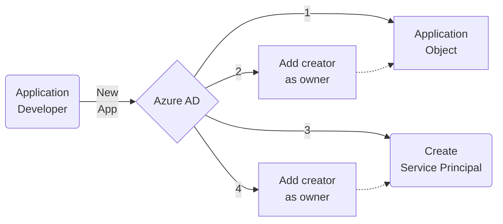

# Identity for Mission Landing Zone Applications
This document contains identity guidance for applications running in Mission Landing Zone.

## Table of Contents
- [Understanding Azure AD Identities](#understanding-azure-ad-identities)
- [Azure AD tenant types](#azure-ad-tenant-types)
- [Enterprise Azure AD tenant](#enterprise-azure-ad-tenant)
- [Application Types](#application-types)
  - Modern Apps
  - Legacy Apps
- Zero Trust
  - Policy Enforcement Point
  - Conditional Access
-- Azure AD for application identity
  - Modern Apps
  - Legacy Apps
- Azure AD Application Proxy and Secure Hybrid Access Partners
- B2B guest identities
- Common Scenarios
  - 1. MLZ subscriptions attached to a separate Azure Platform (MLZ) tenant
  - 2. MLZ subscriptions attached to an Enterprise tenant
  - 3. B2B guests and MLZ
- See Also

## Azure AD - the everything identity platform
Azure Active Directory is not just the Microsoft cloud Identity as a Service (IDaaS) platform, but the everything identity platform for all enterprise applications.

While AAD is the identity platform for Azure and M365, it also directly supports identity for applications that implement industry-standard modern authentication protocols, like OpenID Connect, OAuth, and SAML. Azure AD Application Proxy and Secure Hybrid Access partner integrations allow Azure AD to also provide identity services to legacy apps, even when they are deployed to an on-premises environment or in another cloud.

Azure AD authentication support:
- [x] Software as a Service applications like Service Now, Box, Google Cloud Platform, AWS
- [x] Line-of-Business apps that implement SAML 2.0, WS-Federation, OAuth 2.0, or OpenID Connect protocols
- https://docs.microsoft.com/en-us/azure/active-directory/app-provisioning/tutorial-ecma-sql-connector
- [x] Legacy applications that use Kerberos or NTLM authentication
- [x] Legacy applications that use header-based authentication
- [x] On-premises applications that use SAML or WS-Federation
- [x] Applications that use [password-based sign-in](https://docs.microsoft.com/en-us/azure/active-directory/manage-apps/configure-password-single-sign-on-non-gallery-applications)
- [x] Applications that use an identity broker like F5, NetScaler, KeyCloak, Ping, Okta, or ADFS
- [x] Login for Azure VMs, On-Premises Linux VMs with Azure Arc
- [x] Azure PaaS services like Azure SQL App Service, Azure Functions
- [x] PowerApps Portals
- [ ] Applications that use non-standard authentication protocols
- [ ] Applications that implement standard protocols without TLS (HTTPS)
- [ ] Applications that use legacy protocols without Application Proxy or Secure Hybrid Access Partner
- [ ] Applications with some rare protocol requirements like SAML Holder-of-Key support
  
Azure AD user provisioning support:
- [x] Applications that use SCIM 2.0 identity management protocol
- [x] Applications that use SQL or AD LDS via [Azure AD ECMA connector (preview)](https://docs.microsoft.com/en-us/azure/active-directory/app-provisioning/tutorial-ecma-sql-connector)
- [x] Applications that use SAML-Based provisioning using IDP-Initiated sign in
- [ ] Provisioning users from one Azure AD to another
- [ ] Provisioning users to AD DS environment from Azure AD source
- [ ] Provisioning users to Microsoft server-based products like Microsoft Identity Manager or the user profile service in SharePoint Server

> **Reference**: [Getting started with Azure AD Applications](https://docs.microsoft.com/en-us/azure/active-directory/manage-apps/plan-an-application-integration)
> [How application provisioning works in Azure AD](https://docs.microsoft.com/en-us/azure/active-directory/app-provisioning/how-provisioning-works)

> **Note**:
> Azure AD application features and partner integrations are constantly improving. Feature availability may differ between commercial and other Azure AD instances.

## Azure Active Directory and Zero Trust
Discuss Conditional Access and why it is important to put Azure AD in the path of authentication.

> :warning: **Important**: Standardizing on Azure AD as the organization's enterprise identity platform is the most important step in adopting zero trust principles. Bring Azure AD into the authentication path to every app.

## Understanding Azure AD Identities
Azure AD can authenticate users in the AAD tenant with applications integrated with the tenant.

Azure AD identities include more than just user objects. Every entitity in Azure can be assigned an identity in Azure AD. This functionality allows Azure resources and applications to access Azure with their own protected identity. In this way, application or Virtual Machine identities can be granted access to APIs protected by Azure AD, like the Microsoft Graph API.

Azure AD identities, like users, security groups, and managed identities, are also security principals - they can be assigned Azure and Azure AD RBAC roles.

> 📘 **Reference**: [Permissions Management in Azure and Azure AD](https://github.com/amasse3/MLZ-Identity-AzureADSetup/blob/main/doc/AAD-Permissions-Management.md)

### What are Azure AD identities used for?
These identities can be used for any of the following:
- User authentication to applications
- Application authentication to protected APIs
- Azure AD management permissions
  - Azure AD directory role assignment
  - Scoped permissions for Microsoft Graph API
- Licensing for Microsoft products and features, such as Azure AD Premium P2, or M365 E5
- Management plane access to resources in Azure Resource Manager
  - Azure resource RBAC permission assignment
- Data plane access to Azure resources via data plane RBAC roles
  - Azure Key Vault data access
  - Azure Storage Account access
  - Azure VM login
  - Windows Admin Center
- User or System-Assigned Managed Identities
  - Configure management or data plane access to an Azure resource for a different resource (VM or App identity accessing Key Vault secret)
- Management plane access to other clouds
  - AWS
  - Google Cloud
  - SaaS apps like Service Now, Box, etc.
- Data plane access outside of Azure
  - Azure Arc agent and managed identity
    - Deploy other agents and extensions
    - Microsoft Defender for Endpoint
    - Update Management
  - SSH to non-Azure Linux server with Azure Arc
  
While an Azure AD tenant can contain identies for every use case mentioned in this section (and more), not every tenant will be used for all possible purposes. Some Azure AD tenants may provide identity for M365 services and other SaaS applications, but not have any Azure subscriptions attached. For these tenants, managed resource identities and Azure RBAC assignments will not exist. Other Azure AD tenants have attached Azure subscriptions, but not support identity for any enterprise services or applications. These tenants may only include a select few adminstrators and developers with cloud-only acounts.

> 📘 **Reference**: Review the Tenant Types outlined in [Identity Patterns for Mission Landing Zone](/MLZ-Identity-AzureADSetup/doc/MLZ-Common-Patterns.md)

## Enterprise Azure AD tenant
An organization's Azure AD that contains all users and licenses is an **Enterprise Azure AD Tenant**. These tenants are often configured for hybrid identity with users and groups synchronized from an on-Premises Active Directory enviornment using Azure AD Connect, or provisioned into Azure AD directly from a support HR SaaS Provider. All non-Microsoft applications, including applications running on-premises, in other clouds, SaaS apps, or Azure subscriptions pinned to *other* non-Enterprise AAD should use the **Enterprise Azure AD** for identity.

## What is an Azure AD Application?
Applications interface with Azure AD in two main ways:
1. Web applications, APIs, SPAs use Azure AD to authenticate and authorize users
  - M365 Applications like Exchange Online and Teams
  - SaaS apps from the [Azure AD Application Gallery](https://learn.microsoft.com/en-us/azure/active-directory/manage-apps/overview-application-gallery)
2. Applications interacting with APIs protected by Azure AD
  - Microsoft Graph API
  - Azure Resource Graph
  - Resource APIs (e.g. Key Vault, Azure Storage)
  - APIs for apps developed by your organization

### Object Types
Applications are represented by two separate object types:

- **Application Object** (Application Registrations) is the definition of the application. This configuration is only present in the home tenant for multi-tenant apps and tells Azure AD how to issue tokens for the application.
- **Service Principal** (Enterprise Applications) is the configuration that governs an application's connection to Azure AD. Every application registration has exactly 1 service principal added to the application's home directory.

When an application is added to Azure AD through the Azure Portal:
1. The application object (App Registration) object is created in AAD
2. User is added as owner to the Application object (App Registration)
3. Service principal (Enterprise App) is added for the application
4. User is added as owner to the Service Principal (Enterprise App)

## Enterprise Apps

### The MyApps Portal
Any enterprise application [My Apps](https://docs.microsoft.com/en-us/azure/active-directory/manage-apps/myapps-overview) is a customizable portal that offers a launchpad for accessing enterprise applications integrated with Azure AD.

### Modern and Legacy Apps
Applications used within the enterprise should use standard protocols for authentication and authorization that offer integration with most identity provider systems. To simplify the conversation, apps can be categorized based on the type of identity protocols they use. 
- [Modern applications](#legacy-apps)
- [Legacy applications](#modern-apps)

#### Modern Apps
**Modern applications** use identity protocols that build on top of Hypertext Transfer Protocol and TLS-secured communications over the internet on port 443.

Authentication to these apps uses a passive client, like a web browser, to perform sign-in with an identity provider that is also accessible over the internet. After successful authentication to the identity provider, the identity provider sends an HTTP response with 302-redirect back to the application sign-in endpoint with a cryptographically signed (and sometimes encrypted) token. Once the application verifies the token, the application sign-in is complete.

Common protocols for modern apps include [OpenID-Connect](https://docs.microsoft.com/en-us/azure/active-directory/fundamentals/auth-oidc), [OAuth 2.0](https://docs.microsoft.com/en-us/azure/active-directory/fundamentals/auth-oauth2), [SAML](https://docs.microsoft.com/en-us/azure/active-directory/fundamentals/auth-saml), [WS-Federation](https://docs.microsoft.com/en-us/openspecs/windows_protocols/ms-adfsod/204de335-ea34-4f9b-ae73-8b7d4c8152d1).

|**Example**|Modern Application|
|-------|-----------------------|
|**Realm**|Internet|
|**AuthN Protocol**|OpenID Connect, OAuth 2.0, SAML 2.0, WS-Federation|
|**Token**|ID and Access Tokens (JWT), Code, SAML Token|
|**Authorization**|Role claim from AAD|
|**Development Library**|Microsoft Authentication Library (MSAL)|

#### Legacy Apps
**Legacy applications** use protocols intended for client-server authentication within a trusted realm such as a corporate network. Authentication happens using credentials supplied directly to the application. These applications often use [Kerberos](https://docs.microsoft.com/en-us/windows-server/security/kerberos/kerberos-authentication-overview) ([Windows Authentication](https://docs.microsoft.com/en-us/windows-server/security/windows-authentication/windows-authentication-overview)), [NTLM](https://docs.microsoft.com/en-us/windows-server/security/kerberos/ntlm-overview), [LDAP](https://docs.microsoft.com/en-us/azure/active-directory/fundamentals/auth-ldap), or [header-based](https://docs.microsoft.com/en-us/azure/active-directory/fundamentals/auth-header-based) authentication.

|**Example**|Legacy Application|
|-------|-----------------------|
|**Realm**|AD Forest (Kerberos domain), enterprise network|
|**AuthN Protocol**|Kerberos, NTLM, header-based|
|**Token**|Kerberos ticket, AuthZ Header|
|**Authorization**|Kerberos PAC (AD security group), within application|
|**Development Library**|Windows Identity Foundation|

## Azure AD and On-Premises Applications

> **Note**: The location of the application hosting infrastructure has no bearing on whether or not Azure AD can be an identity provider. Azure AD can be used for modern apps as long as authenticating clients have internet access and a network path to the application. 
> Azure AD can be used for legacy apps as long as Azure AD Application Proxy or Secure Hybrid Access Partner broker is used.

> 📘 **Reference**: [Secure Hybrid Access with Azure AD](https://docs.microsoft.com/en-us/azure/active-directory/manage-apps/secure-hybrid-access)

### Azure AD Application Proxy
### Secure Hybrid Access Partners
### Active Directory Domain Services in Azure

## Collaboration with Azure AD
### B2B Collaboration
### Identity broker

### MLZ Subscriptions attached to Enterprise Azure AD tenant
An organization's Azure AD that contains all users and licenses is an **Enterprise Azure AD Tenant**. These tenants are often configured for hybrid identity with users and groups synchronized from an on-Premises Active Directory enviornment using Azure AD Connect, or provisioned into Azure AD directly from a support HR SaaS Provider. All non-Microsoft applications, including applications running on-premises, in other clouds, SaaS apps, or Azure subscriptions pinned to *other* non-Enterprise AAD should use the **Enterprise Azure AD** for identity.
- **Modern Applications** using OpenIDConnect, OAuth, SAML, WS-Federation can use Azure AD identity directly when onboarded as an [Enterprise Application](https://docs.microsoft.com/en-us/azure/active-directory/manage-apps/add-application-portal).
- **Legacy Applications** using Kerberos (Windows Authentication), NTLM, Header-Based authentication can use Azure AD identities indirectly via [Azure AD Application Proxy](https://docs.microsoft.com/en-us/azure/active-directory/app-proxy/application-proxy) or a [Secure Hybrid Access Partner](https://docs.microsoft.com/en-us/azure/active-directory/manage-apps/secure-hybrid-access) acting as a broker.

> **Important**:  
Applications hosted in MLZ should use the **Enterprise Azure AD** tenant for application identity, directly or via Azure AD Application Proxy / broker. This means applications relying on Active Directory Domain Services need AD DS extended to the MLZ Azure environment through extending existing Active Directory domain or resource forest in Azure. 
In either case, Azure AD Application proxy connectors are recommended to broker access for the Enterprise AAD identities. This allows publishing applications securely without relying on costly network appliances (application firewalls and VPN gateways), while bringing the power of Azure AD Conditional Access to enforce zero trust policies based on authentication context, session details, device health, and identity risk.

### MLZ Subscriptions attached to a separate, standalone Azure Platform tenant
In some cases, customers choose to use a separate Azure AD where their subscriptions are managed. This configuration introduces complexity for Azure services that are accessed by Azure AD identities, since users either need A) Separate Azure AD accounts and licenses in each tenant, B) Rely on Azure AD B2B Guests and switching tenant context, C) configuring light house for all Azure resource access.

## See Also
Relevant links