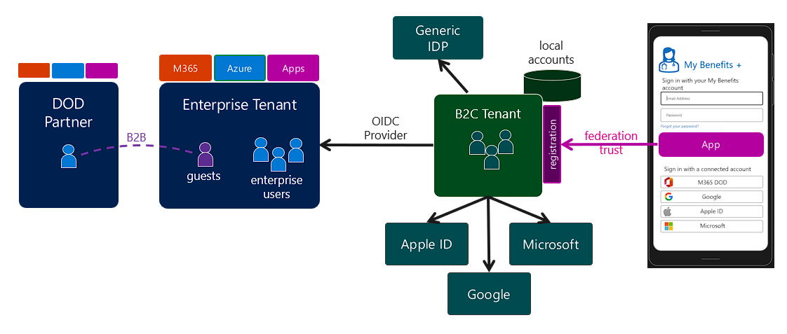

# Identity for Mission Landing Zone Applications
This document contains identity guidance for applications running in Mission Landing Zone.

## Table of Contents
- [Azure AD - the everything identity platform](#azure-ad---the-everything-identity-platform)
- [Azure Active Directory and Zero Trust](#azure-active-directory-and-zero-trust)
- [Understanding Azure AD Identities](#understanding-azure-ad-identities)
- [Application Types](#application-types)
- [Collaboration with Azure AD](#collaboration-with-azure-ad)
- [See Also](#see-also)

## Azure AD - the everything identity platform
Azure Active Directory is not just the Microsoft cloud Identity as a Service (IDaaS) platform, but the everything identity platform for all enterprise applications.

While AAD is the identity platform for Azure and M365, it also directly supports identity for applications that implement industry-standard modern authentication protocols, like OpenID Connect, OAuth, and SAML. Azure AD Application Proxy and Secure Hybrid Access partner integrations allow Azure AD to also provide identity services to legacy apps, even when they are deployed to an on-premises environment or in another cloud.

Azure AD authentication support:
- [x] Software as a Service applications like Service Now, Box, Google Cloud Platform, AWS
- [x] Line-of-Business apps that implement SAML 2.0, WS-Federation, OAuth 2.0, or OpenID Connect protocols
- https://docs.microsoft.com/en-us/azure/active-directory/app-provisioning/tutorial-ecma-sql-connector
- [x] Legacy applications that use Kerberos or NTLM authentication
- [x] Legacy applications that use header-based authentication
- [x] On-premises applications that use SAML or WS-Federation
- [x] Applications that use [password-based sign-in](https://docs.microsoft.com/en-us/azure/active-directory/manage-apps/configure-password-single-sign-on-non-gallery-applications)
- [x] Applications that use an identity broker like F5, NetScaler, KeyCloak, Ping, Okta, or ADFS
- [x] Login for Azure VMs, On-Premises Linux VMs with Azure Arc
- [x] Azure PaaS services like Azure SQL App Service, Azure Functions
- [x] PowerApps Portals
- [ ] Applications that use non-standard authentication protocols
- [ ] Applications that implement standard protocols without TLS (HTTPS)
- [ ] Applications that use legacy protocols without Application Proxy or Secure Hybrid Access Partner
- [ ] Applications with some rare protocol requirements like SAML Holder-of-Key support
  
Azure AD user provisioning support:
- [x] Applications that use SCIM 2.0 identity management protocol
- [x] Applications that use SQL or AD LDS via [Azure AD ECMA connector (preview)](https://docs.microsoft.com/en-us/azure/active-directory/app-provisioning/tutorial-ecma-sql-connector)
- [x] Applications that use SAML-Based provisioning using IDP-Initiated sign in
- [ ] Provisioning users from one Azure AD to another
- [ ] Provisioning users to AD DS environment from Azure AD source
- [ ] Provisioning users to Microsoft server-based products like Microsoft Identity Manager or the user profile service in SharePoint Server

> **Reference**: [Getting started with Azure AD Applications](https://docs.microsoft.com/en-us/azure/active-directory/manage-apps/plan-an-application-integration)
> [How application provisioning works in Azure AD](https://docs.microsoft.com/en-us/azure/active-directory/app-provisioning/how-provisioning-works)

> **Note**:
> Azure AD application features and partner integrations are constantly improving. Feature availability may differ between commercial and other Azure AD instances.

## Azure Active Directory and Zero Trust
Discuss Conditional Access and why it is important to put Azure AD in the path of authentication.

> :warning: **Important**: Standardizing on Azure AD as the organization's enterprise identity platform is the most important step in adopting zero trust principles. Bring Azure AD into the authentication path to every app.

## Understanding Azure AD Identities
Azure AD can authenticate users in the AAD tenant with applications integrated with the tenant.

Azure AD identities include more than just user objects. Every entitity in Azure can be assigned an identity in Azure AD. This functionality allows Azure resources and applications to access Azure with their own protected identity. In this way, application or Virtual Machine identities can be granted access to APIs protected by Azure AD, like the Microsoft Graph API.

Azure AD identities, like users, security groups, and managed identities, are also security principals - they can be assigned Azure and Azure AD RBAC roles.

> 📘 **Reference**: [Permissions Management in Azure and Azure AD](https://github.com/amasse3/MLZ-Identity-AzureADSetup/blob/main/doc/AAD-Permissions-Management.md)

### What are Azure AD identities used for?
These identities can be used for any of the following:
- User authentication to applications
- Application authentication to protected APIs
- Azure AD management permissions
  - Azure AD directory role assignment
  - Scoped permissions for Microsoft Graph API
- Licensing for Microsoft products and features, such as Azure AD Premium P2, or M365 E5
- Management plane access to resources in Azure Resource Manager
  - Azure resource RBAC permission assignment
- Data plane access to Azure resources via data plane RBAC roles
  - Azure Key Vault data access
  - Azure Storage Account access
  - Azure VM login
  - Windows Admin Center
- User or System-Assigned Managed Identities
  - Configure management or data plane access to an Azure resource for a different resource (VM or App identity accessing Key Vault secret)
- Management plane access to other clouds
  - AWS
  - Google Cloud
  - SaaS apps like Service Now, Box, etc.
- Data plane access outside of Azure
  - Azure Arc agent and managed identity
    - Deploy other agents and extensions
    - Microsoft Defender for Endpoint
    - Update Management
  - SSH to non-Azure Linux server with Azure Arc
  
While an Azure AD tenant can contain identies for every use case mentioned in this section (and more), not every tenant will be used for all possible purposes. Some Azure AD tenants may provide identity for M365 services and other SaaS applications, but not have any Azure subscriptions attached. For these tenants, managed resource identities and Azure RBAC assignments will not exist. Other Azure AD tenants have attached Azure subscriptions, but not support identity for any enterprise services or applications. These tenants may only include a select few adminstrators and developers with cloud-only acounts.

> 📘 **Reference**: Review the Tenant Types outlined in [Identity Patterns for Mission Landing Zone](/MLZ-Identity-AzureADSetup/doc/MLZ-Common-Patterns.md)

### What is an Azure AD Application?
Applications interface with Azure AD in two main ways:
1. Web applications, APIs, SPAs use Azure AD to authenticate and authorize users
  - M365 Applications like Exchange Online and Teams
  - SaaS apps from the [Azure AD Application Gallery](https://learn.microsoft.com/en-us/azure/active-directory/manage-apps/overview-application-gallery)
2. Applications interacting with APIs protected by Azure AD
  - Microsoft Graph API
  - Azure Resource Graph
  - Resource APIs (e.g. Key Vault, Azure Storage)
  - APIs for apps developed by your organization

> 📘 **Reference**: [Integrating Azure Active Directory with applications - getting started guide](https://learn.microsoft.com/en-us/azure/active-directory/manage-apps/plan-an-application-integration)

### Application Object Types
Applications are represented by two separate object types:

- **Application Object** (Application Registrations) is the definition of the application including:
  - How Azure AD can issue tokens for accessing the application
  - The resources the application might need access to
  - The actions the application can take (permissions)
- **Service Principal** (Enterprise Applications) is the configuration that governs an application's connection to Azure AD. Every application registration has exactly 1 service principal added to the application's home directory. Service Principals fall into 3 cateogies:
  - Applications (Default filter for Enterprise Applications blade)
  - Managed identities
  - Legacy (does not have associated app registration)

> 📘 **Reference**: [Applications and service principals](https://learn.microsoft.com/en-us/azure/active-directory/develop/app-objects-and-service-principals)

### Creating Application Objects
An application is created in AAD in any of the following circumstances:
- User with **Application Developer** role creates an application registration via the Azure Portal or Graph API
- User with permissions to an Azure subscription creates a managed identity in Azure
  - A user-assigned managed identity created manually
  - A system-assigned managed identity created for an Azure resource
- User with **Cloud Application Administrator** role creates a new Enterprise App from a gallery template or Non-Gallery app
- User with **Application Administrator** role creates a new Enterprise App for a on-premises application using Azure AD Application Proxy

#### Permissions
By default, *any* Azure AD user can register applications. The [MLZ AAD Baseline](./AAD-Config-Baseline.md#6-configure-user-group-and-external-collaboration-settings) recommends disabling this feature. When this setting is restricted, creating application objects requires permissions only granted by the [**Application Developer**](https://learn.microsoft.com/en-us/azure/active-directory/roles/permissions-reference#application-developer), [**Cloud Application Administrator**](https://learn.microsoft.com/en-us/azure/active-directory/roles/permissions-reference#cloud-application-administrator), [**Application Administrator**](https://learn.microsoft.com/en-us/azure/active-directory/roles/permissions-reference#application-administrator), or [**Global Administrator**](https://learn.microsoft.com/en-us/azure/active-directory/roles/permissions-reference#global-administrator) built-in Azure AD directory roles.

| Activity | Application Developer | Cloud Application Administrator | Application Administrator | Application Owner |
|----------|:---------------------:|:-------------------------------:|:------------------------:|:------------------:|
|Create App Registrations|x|x|x||
|Create Service Principals|x|x|x||
|Create App from Enterprise Apps Experience||x|x||
|Onboard On-Prem App through Enterprise Apps Experience|||x||
|Mananage Application Object|x|x|x|x|
|Manage Application Service Principal|x|x|x|x|
|Grant Admin Consent for APIs1 (except MS Graph API)||x|x||

1Only the **Global Administrator** or **Privileged Role Administrator** can grant access to the Azure AD Graph or Microsoft Graph.

> **Note**: Creating apps via Enterprise Apps in the portal requires **Cloud Application Administrator** or better. The **Application Developer** role cannot perform this action. Enterprise apps created in this manner require additional permissions to configure features like provisioning. Any app that needs SAML or password-based single sign-on must be created from the Enterprise Apps blade. Enterprise apps created using Application Developer role and the App registration will display a note that single sign-on configuration is not available.

> 📘 **Reference**: 
> - [Grant tenant-wide consent to an application](https://learn.microsoft.com/en-us/azure/active-directory/manage-apps/grant-admin-consent?pivots=portal)
> - [Azure AD built-in roles](https://learn.microsoft.com/en-us/azure/active-directory/roles/permissions-reference)

#### Object creation and owner assignment
When an application is added to Azure AD, four steps occur:
1. The application object (App Registration) object is created in AAD
2. User is added as owner to the Application object (App Registration)
3. Service principal (Enterprise App) is added for the application
4. User is added as owner to the Service Principal (Enterprise App)

The diagram below describes this process:

> 📘 **Reference**:
> - [How and why applications are added to Azure AD](https://learn.microsoft.com/en-us/azure/active-directory/develop/active-directory-how-applications-are-added)
> - [What is application management in Azure Active Directory](https://learn.microsoft.com/en-us/azure/active-directory/manage-apps/what-is-application-management)

### The MyApps Portal
[My Apps](https://docs.microsoft.com/en-us/azure/active-directory/manage-apps/myapps-overview) is a customizable portal that offers a launchpad for accessing enterprise applications integrated with Azure AD. Visibility and assignment requirements is configured via Enterprise Apps by a **Cloud Application Administrator**, **Application Administrator** or the **Owner** of the application service principal.

## Application Types
Azure AD supports nearly every application using [modern protocols](#modern-apps) like OpenID Connect, OAuth 2.0, SAML 2.0, and WS-Federation. Support for [legacy applications](#legacy-apps) that may use Active Directory Domain Services for authentication is enabled by Microsoft [Azure AD Application Proxy](#azure-ad-application-proxy), an identity-aware proxy agent deployed to Windows Server infrastructure.

The diagram below describes modern and legacy apps deployed to MLZ.

### Modern and Legacy Apps
Applications used within the enterprise should use standard protocols for authentication and authorization that offer integration with most identity provider systems. To simplify the conversation, apps can be categorized based on the type of identity protocols they use. 
- [Modern applications](#legacy-apps)
- [Legacy applications](#modern-apps)

#### Modern Apps
**Modern applications** use identity protocols that build on top of Hypertext Transfer Protocol and TLS-secured communications over the internet on port 443.

Authentication to these apps uses a passive client, like a web browser, to perform sign-in with an identity provider that is also accessible over the internet. After successful authentication to the identity provider, the identity provider sends an HTTP response with 302-redirect back to the application sign-in endpoint with a cryptographically signed (and sometimes encrypted) token. Once the application verifies the token, the application sign-in is complete.

Common protocols for modern apps include [OpenID-Connect](https://docs.microsoft.com/en-us/azure/active-directory/fundamentals/auth-oidc), [OAuth 2.0](https://docs.microsoft.com/en-us/azure/active-directory/fundamentals/auth-oauth2), [SAML](https://docs.microsoft.com/en-us/azure/active-directory/fundamentals/auth-saml), [WS-Federation](https://docs.microsoft.com/en-us/openspecs/windows_protocols/ms-adfsod/204de335-ea34-4f9b-ae73-8b7d4c8152d1).

|**Example**|Modern Application|
|-------|-----------------------|
|**Realm**|Internet|
|**AuthN Protocol**|OpenID Connect, OAuth 2.0, SAML 2.0, WS-Federation|
|**Token**|ID and Access Tokens (JWT), Code, SAML Token|
|**Authorization**|Role claim from AAD|
|**Development Library**|Microsoft Authentication Library (MSAL)|

#### Legacy Apps
**Legacy applications** use protocols intended for client-server authentication within a trusted realm such as a corporate network. Authentication happens using credentials supplied directly to the application. These applications often use [Kerberos](https://docs.microsoft.com/en-us/windows-server/security/kerberos/kerberos-authentication-overview) ([Windows Authentication](https://docs.microsoft.com/en-us/windows-server/security/windows-authentication/windows-authentication-overview)), [NTLM](https://docs.microsoft.com/en-us/windows-server/security/kerberos/ntlm-overview), [LDAP](https://docs.microsoft.com/en-us/azure/active-directory/fundamentals/auth-ldap), or [header-based](https://docs.microsoft.com/en-us/azure/active-directory/fundamentals/auth-header-based) authentication.

|**Example**|Legacy Application|
|-------|-----------------------|
|**Realm**|AD Forest (Kerberos domain), enterprise network|
|**AuthN Protocol**|Kerberos, NTLM, header-based|
|**Token**|Kerberos ticket, AuthZ Header|
|**Authorization**|Kerberos PAC (AD security group), within application|
|**Development Library**|Windows Identity Foundation|

## Azure AD and On-Premises Applications
The location of the application hosting infrastructure has no bearing on whether or not Azure AD can be an identity provider. Azure AD can be used for modern apps as long as authenticating clients have internet access and a network path to the application. Azure AD can be used for legacy apps as long as Azure AD Application Proxy or Secure Hybrid Access Partner broker is used.

> 📘 **Reference**: [Secure Hybrid Access with Azure AD](https://docs.microsoft.com/en-us/azure/active-directory/manage-apps/secure-hybrid-access)

### Azure AD Application Proxy
Azure AD Application proxy is a simple, secure, and cost-effective way to extend Azure AD capabilities to legacy apps and publish on-premises apps for external access with Azure AD pre-authentication. Deploying Azure AD Application Proxy to the Identity Subscription for MLZ is a fast and easy way to lift+shift on-premises applications without code change or application re-factoring.

Apps published through App Proxy can use Conditional Access and other controls, such as Authentication Strength, route through Defender for Cloud Apps, just like a modern cloud-hosted application.

> **Note**: In most cases, the legacy application will still require Active Directory Domain Controllers be accessible to the Application server and App Proxy Connectors.

> 📘 **Reference**: [Remote access to on-premises applications through Azure AD Application Proxy](https://learn.microsoft.com/en-us/azure/active-directory/app-proxy/application-proxy)

### Active Directory Domain Services in Azure
Legacy applications that need Active Directory for kerberos authentication or LDAP interface rely on extending the on-premises Active Directory forest to Azure. In this model, domain controllers are hosted in the MLZ Identity subscription.

> 📘 **Reference**: 
> - [Deploy AD DS in an Azure VNet](https://learn.microsoft.com/en-us/azure/architecture/reference-architectures/identity/adds-extend-domain)
> - [Create an AD DS resource forest in Azure](https://learn.microsoft.com/en-us/azure/architecture/reference-architectures/identity/adds-forest)

### Azure Active Directory Domain Services
Not to be confused with AD DS in Azure, [Azure AD DS](https://learn.microsoft.com/en-us/azure/active-directory-domain-services/overview), provides a way to extend Azure AD capabilities to a managed AD DS forest.

> **Note**: This is not used in most MLZ deployments. Azure AD DS requires a password hash synchronized from Azure AD to the managed domain.

> 📘 **Reference**:
> - [What is Azure Active Directory Domain Services](https://learn.microsoft.com/en-us/azure/active-directory-domain-services/overview)
> - [Compare self-managed AD DS with Azure Active Directory and Azure AD DS](https://learn.microsoft.com/en-us/azure/active-directory-domain-services/compare-identity-solutions)
> - [How objects and credentials are synced in Azure AD DS](https://learn.microsoft.com/en-us/azure/active-directory-domain-services/synchronization)

## Collaboration with Azure AD
Azure Active Directory makes it easy to collaborate with other organizations that use Azure AD.

### B2B Collaboration
Azure AD B2B collaboration is a feature within External Identities that provides a guest invitation mechanism for onboarding guest Azure AD users homed outside of your organization. Review the [external collaboration settings](https://learn.microsoft.com/en-us/azure/active-directory/external-identities/external-collaboration-settings-configure) and the [baseline MLZ identity add-on configuration](./AAD-Config-Baseline.md#6-configure-user-group-and-external-collaboration-settings) and determine what changes are needed to support collaboration with partners.

Once a guest user redeems their invite to your directory, they can be assigned to enterprise applications in your tenant. See [Authentication and Conditional Access for External Identities](https://learn.microsoft.com/en-us/azure/active-directory/external-identities/authentication-conditional-access#authentication-flow-for-external-azure-ad-users) for a detailed overview of B2B application access.

Use [cross-tenant access settings (XTAP)](https://learn.microsoft.com/en-us/azure/active-directory/external-identities/cross-tenant-access-settings-b2b-collaboration) to improve security and user experience for B2B guests.

> 📘 **Reference**: 
> - [B2B Collaboration Overview](https://learn.microsoft.com/en-us/azure/active-directory/external-identities/what-is-b2b)
> - [Authentication and Conditional Access for External Identities](https://learn.microsoft.com/en-us/azure/active-directory/external-identities/authentication-conditional-access#authentication-flow-for-external-azure-ad-users)
> - [Azure Active Directory B2B Best Practices](https://learn.microsoft.com/en-us/azure/active-directory/external-identities/b2b-fundamentals)

### Identity broker
Another security token service like Active Directory Federation Services or Azure AD B2C tenant can act as a broker for applications with complex identity requirements. One example is apps that support 1 identity provider, but some users cannnot be in Azure AD.

The diagram below describes the trust model for integrating Azure AD B2C and it's applications with Azure AD. During sign-in, users choose which type of account to use for accessing the app.

The diagram below describes the authentication process for an Azure AD user accessing an application integrated with a broker security token service (STS):

## See Also
- [Return Home](/README.md)