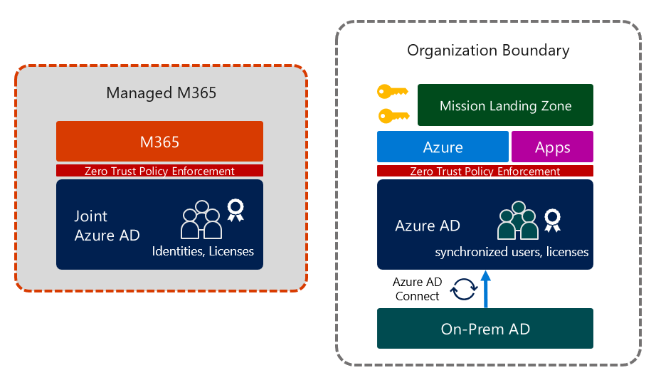

# Identity Deployment Patterns for Mission Landing Zone
Azure is more than a cloud platform for IaaS and PaaS services. Core to Azure's functionality is the identity platform, Azure Active Directory. Azure AD is the required identity platform for Azure and M365 services. Zero Trust, management, application protocol support, and identity governance capabilities baked in for M365 make Azure AD a truly enterprise-ready modern identity platform, even for organizations that plan to only use Azure AD for their Azure subscriptions.

> 💡 **Goal**:
> Consolidate around Azure Active Directory as the enterprise identity platform. Determining which Azure AD tenant will serve as the organization's "enterprise" identity platform help clarify which deployment pattern should be used for MLZ applications.

This document outlines common identity deployment patterns for Mission Landing Zone.

## Table of contents
- 1. [Common Deployment Types](#common-deployment-types)
- 2. [Type 1: MLZ deployed to existing enterprise M365 tenant](#type-1-mlz-deployed-to-existing-enterprise-m365-tenant)
- 3. [Type 2: MLZ deployed to a *standalone* Azure platform tenant](#type-2-mlz-deployed-to-standalone-azure-platform-tenant)
- 4. [Type 3: MLZ deployed to an *enterprise* Azure platform tenant](#type-3-mlz-deployed-to-an-enterprise-azure-platform-tenant)

## Common Deployment Types
There are 3 common deployment patterns for MLZ.
- Type 1: MLZ deployed to existing enterprise M365 tenant
- Type 2: MLZ deployed to a standalone Azure platform tenant
- Type 3: MLZ deployed to an enterprise Azure platform tenant
  - (a) **Hybrid identity** with existing enterprise AD DS
  - (b) **External identities** for Azure AD and Azure management
  - (b) Standalone Azure tenant with **cloud-only identities** (broker model)

### Definitions
| Term | Description |
|------|-------------|
|Azure AD Tenant|An organization's instance of the Azure Active Directory service|
|Enterprise Tenant|The organization's main identity platform for applications, usually an extension of existing AD DS environment with hybrid identity configured (synchronized identities)|
|Standalone Tenant|An Azure AD instance owned by an organization used for a single purpose. Usually this tenant will not have hybrid identity configured, and not contain all users in the organization.|
|Member user|A user who is a member of the organization (user.userType="member")|
|Guest user|A non-member user, usually invited from a different Azure AD tenant using Azure AD B2B (user.userType="guest")|
|Internal user|A user that is local to the Azure AD directory|
|External user|A user that is homed in another Azure AD tenant, usually a B2B guest|
|Cloud-only identity|An Azure AD identity that is an internal member, not synchronized with Azure AD Connect|
|Synchronized identity|An Azure AD identity that is synchronized from Active Directory with Azure AD Connect or Azure AD Conenct cloud sync|

> **Note**: Internal/External and member/guest are orthoganal concepts in Azure AD. An internal account, cloud-only or synchronized, can be type guest. An external user can be type member. Members are users that belong to the organization which must be licensed in Azure AD to use premium features.

> 📘 **References**:
> - [Planning identity for Azure Government applications](https://learn.microsoft.com/en-us/azure/azure-government/documentation-government-plan-identity)
> - [B2B collaboration overview](https://learn.microsoft.com/en-us/azure/active-directory/external-identities/what-is-b2b)
> - [Properties of an Azure Active Directory B2B collaboration user](https://learn.microsoft.com/en-us/azure/active-directory/external-identities/user-properties)
> - [What is Azure AD Connect cloud sync](https://learn.microsoft.com/en-us/azure/active-directory/cloud-sync/what-is-cloud-sync)

## Type 1: MLZ deployed to existing enterprise M365 Tenant

## Type 2: MLZ deployed to standalone Azure platform tenant

## Type 3: MLZ deployed to an enterprise Azure platform tenant

## See Also: