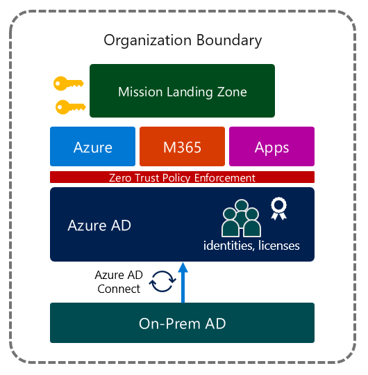

# Identity Deployment Patterns for Mission Landing Zone
Azure is more than a cloud platform for IaaS and PaaS services. Core to Azure's functionality is the identity platform, Azure Active Directory. Azure AD is the required identity platform for Azure and M365 services. Zero Trust, management, application protocol support, and identity governance capabilities baked in for M365 make Azure AD a truly enterprise-ready modern identity platform, even for organizations that plan to only use Azure AD for their Azure subscriptions.

> 💡 **Goal**:
> Consolidate around Azure Active Directory as the enterprise identity platform. Determining which Azure AD tenant will serve as the organization's "enterprise" identity platform help clarify which deployment pattern should be used for MLZ applications.

This document outlines common identity deployment patterns for Mission Landing Zone.

## Table of contents
- [Identity Deployment Patterns for Mission Landing Zone](#identity-deployment-patterns-for-mission-landing-zone)
  - [Table of contents](#table-of-contents)
  - [Common Deployment Types](#common-deployment-types)
    - [Decision Tree](#decision-tree)
    - [Definitions](#definitions)
  - [Type 1: MLZ deployed to existing enterprise M365 Tenant](#type-1-mlz-deployed-to-existing-enterprise-m365-tenant)
    - [Architecture Diagram](#architecture-diagram)
    - [Summary](#summary)
  - [Type 2: MLZ deployed to standalone Azure platform tenant](#type-2-mlz-deployed-to-standalone-azure-platform-tenant)
    - [Architecture Diagram](#architecture-diagram-1)
    - [Summary](#summary-1)
  - [Type 3: MLZ deployed to an enterprise Azure platform tenant](#type-3-mlz-deployed-to-an-enterprise-azure-platform-tenant)
    - [Architecture Diagram](#architecture-diagram-2)
    - [Summary](#summary-2)
  - [Conclusion](#conclusion)
  - [See Also:](#see-also)

## Common Deployment Types
While each organization has unique needs for Azure and Azure AD, most deployments fall into 3 patterns:
- Type 1: MLZ deployed to existing enterprise M365 tenant
- Type 2: MLZ deployed to a standalone Azure platform tenant
  - (a) Cloud-only management model: standalone Azure tenant with **cloud-only identities**
  - (b) Guest management model: **External identities** for Azure AD and Azure management (guest management model)
- Type 3: MLZ deployed to an enterprise Azure platform tenant
  - (a) **Hybrid identity** model: synchornized from existing enterprise AD DS
  - (b) **External identities** model: cross-tenant synchronization, connected organizations / identity governance
  
### Decision Tree
Use this decision tree to determine which MLZ tenant type is appropriate.

````mermaid
graph TD
    A(Start) -->|Evaluate existing <br>services| B{Organization<br> owns M365?}
    B -->|Yes| C{Management<br>Contol?}
    C -->|Managed by<br>organization| D{SoD required?}
    C -->|Managed by<br>another entity|K
    D -->|No| I(<b>Use Existing Tenant</b><br>Type 1)
    D -->|Yes| H(<b>Standalone MLZ</b><br>Type 2)

    B -->|No| J{Existing Enterprise<br>Azure AD?}
    J -->|No| K[Establish new<br>Enterprise tenant] -->G(<b>Enterprise MLZ</b><br>Type 3)
    J -->|Yes| L[Deploy MLZ<br>to existing tenant] --> G
   
````

### Definitions
| Term | Description |
|------|-------------|
|Azure AD Tenant|An organization's instance of the Azure Active Directory service|
|Enterprise Tenant|The organization's main identity platform for applications, usually an extension of existing AD DS environment with hybrid identity configured (synchronized identities)|
|Standalone Tenant|An Azure AD instance owned by an organization used for a single purpose. Usually this tenant will not have hybrid identity configured, and not contain all users in the organization.|
|Member user|A user who is a member of the organization (user.userType="member")|
|Guest user|A non-member user, usually invited from a different Azure AD tenant using Azure AD B2B (user.userType="guest")|
|Internal user|A user that is local to the Azure AD directory|
|External user|A user that is homed in another Azure AD tenant, usually a B2B guest|
|Cloud-only identity|An Azure AD identity that is an internal member, not synchronized with Azure AD Connect|
|Synchronized identity|An Azure AD identity that is synchronized from Active Directory with Azure AD Connect or Azure AD Conenct cloud sync|

> **Note**: Internal/External and member/guest are orthoganal concepts in Azure AD. An internal account, cloud-only or synchronized, can be type guest. An external user can be type member. Members are users that belong to the organization which must be licensed in Azure AD to use premium features.
> **External Guest**: Uses an external Azure AD account to authenticate. Most external users fall into this category.
> **External Member**: Uses an external account to authenticate, but has member level access instead of guest level access. Common for multi-tenant organizations.
> **Internal Guest**: Has an account in your Azure AD directory, but has guest level access. This is legacy guest user often synchronized using Azure AD Connect.
> **Internal Member**: Has an account in your Azure AD directory with member level access. All "typical" members of an organization fall into this category.

> 📘 **References**:
> - [Planning identity for Azure Government applications](https://learn.microsoft.com/en-us/azure/azure-government/documentation-government-plan-identity)
> - [B2B collaboration overview](https://learn.microsoft.com/en-us/azure/active-directory/external-identities/what-is-b2b)
> - [Properties of an Azure Active Directory B2B collaboration user](https://learn.microsoft.com/en-us/azure/active-directory/external-identities/user-properties)
> - [What is Azure AD Connect cloud sync](https://learn.microsoft.com/en-us/azure/active-directory/cloud-sync/what-is-cloud-sync)

## Type 1: MLZ deployed to existing enterprise M365 Tenant
Type 1 is the most straightforward scenario for deploying Azure, since an enterprise Azure Active Directory tenant already exists and is in use for M365. This is a standard, single-tenant topology that Microsoft recommends whenever possible.

Microsoft Azure services that use Azure AD identities expect to use Azure AD identities within the same tenant that the subscription is pinned. The single tenant topology offers the most compatibility and best experience for accessing Azure services.

**Choose Type 1 if:**
- [x] The organization already has an Azure AD tenant containing all users
- [x] The organization plans to deploy M365 services and license users in the existing tenant
- [x] Microsoft 365 tenant Global Administrators are trusted to manage the Azure environment

### Architecture Diagram


### Summary
This table outlines the design elements for Type 1 MLZ deployment.

| Design Area | Solution |
|-------------|----------|
| **Identity integration** | hybrid with Azure AD Connect (existing) |
| **Application identity** | same tenant |
| **Management identity** | same tenant (cloud-only) |
| **Licensing considerations** | re-use existing |
| **Authentication** | cloud-native, phishing-resistant |
| **Conditional Access** | re-use existing baseline | 

## Type 2: MLZ deployed to standalone Azure platform tenant
This topology should be chosen for M365 organizations that need separation of duties for M365 and Azure (MLZ) management. In the Microsoft cloud, Azure Active Directory tenant is a security boundary. An identity with the Global Administrator role iin Azure AD can elevate permissions for Azure subscription management. If resources and data for MLZ are sensitive and cannot share a security boundary with M365 tenant adminsitrators, a separate "standalone" Azure platform tenant may be required.

This Azure Platform tenant can be managed by:
- **A.** cloud-only users
  - or
- **B.** B2B guest identities from the existing M365 / enterprise tenant

> **Note**: If choosing option **B**, ensure separate cloud-only identities in the M365 tenant are invited to the MLZ tenant. Standard user identities should not be used for administration, even if the permissioned access is to manage resources protected by another Azure AD tenant.

**Choose Type 2 if:**
- [x] Microsoft 365 tenant Global Administrators are not trusted to manage the Azure environment
- [x] Security boundary is needed between MLZ Azure workloads and the M365 environment
- [x] Azure Virtual Desktop and other PaaS services that do not support guest identities can be hosted in subscriptions attached to the enterprise tenant.

### Architecture Diagram


### Summary
This table outlines the design elements for Type 2 MLZ deployment.

| Design Area | Solution |
|-------------|----------|
| **Identity integration** | none (cloud-only) |
| **Application identity** | enterprise tenant |
| **Management identity** | A. cloud-only<br />B. B2B guest users |
| **Licensing considerations** | AADP2 for Admins|
| **Authentication** | cloud-native, phishing-resistant |
| **Conditional Access** | New CA baseline | 

## Type 3: MLZ deployed to an enterprise Azure platform tenant
Type 3 is used when no enterprise tenant exists for the organization. Establishing a consolidated Identity as a Service platform is critical to enabling zero trust outcomes. In this model, an organization does not use M365 services, or if they do, consumes M365 as a service managed by a separate entity. End users need to be added to the MLZ tenant to make it an "enterprise" platform.

This can be accomplished by:
- **A.** Deploying Azure AD Connect to synchronize identities from the on-premises Active Directory Domain Services environment
- **B.** Establish a model where all users are invited using Azure AD B2B
  - i. Using classic B2B guest invitations
  - ii. Using Azure AD Entitlements Management Connected Organizations
  - iii.  Using Tenant Synchronization (Preview)

>**Note**: Detailed setup for hybrid identity or guest collaboration models are beyond the scope of this document. Features are evolving in this area. Follow the [Microsoft Entra blog](https://techcommunity.microsoft.com/t5/microsoft-entra-azure-ad-blog/bg-p/Identity) for the latest announcements.

**Choose Type 3 if:**
- [x] No other Azure Active Directory is managed by the organization
- [x] MLZ Azure AD will be the enterprise Identity as a Service platform for the organization
- [x] M365 services are managed by a service provider in a different tenant

### Architecture Diagram


### Summary
This table outlines the design elements for Type 2 MLZ deployment.

| Design Area | Solution |
|-------------|----------|
| **Identity integration** | A. Hybrid with new AADC<br />B. None (guests)|
| **Application identity** | same tenant |
| **Management identity** | same tenant (cloud-only) |
| **Licensing considerations** | A. AADP2 for all users<br />B. AADP2 for admins<br /> |
| **Authentication** | cloud-native, phishing-resistant |
| **Conditional Access** | New CA baseline | 

## Conclusion
While each organization has unique identity needs for Azure and M365, MLZ deployments tend to follow the common patterns outlined here.

Keep the following *tenets** in mind when determining which *tenant* model to use for MLZ:
- Every organization should have an established **enterprise** identity platform in the cloud
- This is usually, but not always, the Azure AD used for M365 services
- Whenever possible, reduce the # of tenants owned and managed by a single organization
- There is no "once size fits all" for organizations needing multiple Azure AD tenants

## See Also:
[MLZ Identity Add-On Home](/README.md)